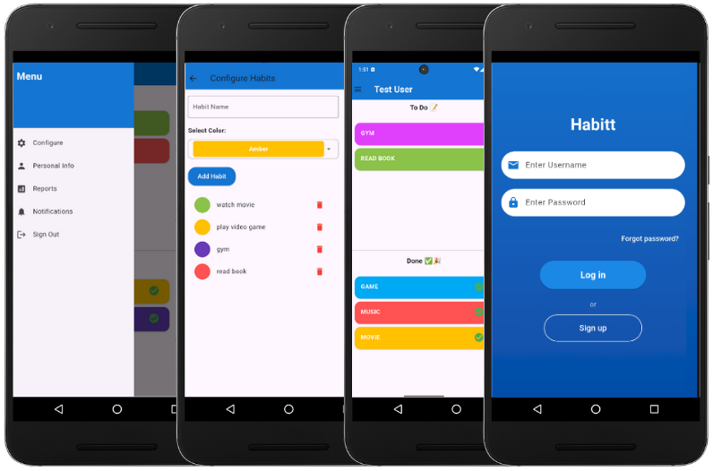

<h1 align="center">The Habit Tracker app</h1> <br>
<p align="center">
  <a href="https://flutter.dev/">
    
  </a>
</p>

<p align="center">
  Build for any screen .
</p>


<!-- START doctoc generated TOC please keep comment here to allow auto update -->
<!-- DON'T EDIT THIS SECTION, INSTEAD RE-RUN doctoc TO UPDATE -->
## Table of Contents

- [Introduction](#introduction)
- [Features](#features)
- [About](#about)
- [Feedback](#feedback)
- [Build Process](#build-process)

<!-- END doctoc generated TOC please keep comment here to allow auto update -->

## Introduction

[](https://flutter.dev/)


[](https://github.com/ahmedzghal-dev)
[](https://www.linkedin.com/in/ahmed-zghal/)


Our mandate is to develop a robust and user-friendly app using Flutter, depending on the framework that best aligns with our expertise or interests.

This project is designed to apply the concepts and skills we've acquired in any of the following programs:

 * IBM iOS and Android Mobile App Developer Professional Certificate
 * Developing Mobile Apps with Flutter Specialization

This project aims to develop a mobile app that adheres to industry best practices for user experience, performance, and functionality. Thats why we created the Habit Tracker app.


**Available for Android.**

<p align="center">
  
</p>

## Features

A few of the things you can do with Habit Tracker:

* **User authentication:** Allow users to log in and register with proper validation.
* **Home and detail screens:** Build intuitive screens for displaying and interacting with core app data.
* **Data persistence and API integration:** Store user data locally and fetch or send data via APIs.
* **Settings and notifications:** Provide configurable options for users and integrate notifications.
* **Error** Handling and Loading Indicators


<p align="center">
  
</p>


## About the Weather App

- The Habit Tracker app is designed to help users build and maintain positive habits by tracking their daily activities and goals. Developed using Flutter, this app provides an intuitive and visually appealing interface for managing habits, categorizing tasks, and monitoring progress. Key features include personalized habit creation, color-coded task management, notifications for reminders, and secure user preferences storage. The app leverages essential Flutter packages like shared_preferences for data persistence, flutter_local_notifications for notification management, http for network operations, and fluttertoast for user feedback messages, ensuring a smooth and responsive user experience.


## Feedback

Feel free to send us feedback on [Linkedin](https://www.linkedin.com/in/ahmed-zghal/). Feature requests are always welcome.


## Build Process

1. Ensure you have the following tools installed on your system:
    - Flutter SDK (latest stable version)
    - Android Studio or Visual Studio Code (with Flutter and Dart plugins)
    - Java Development Kit (JDK)

2. Clone the Repository

    ``` git clone https://github.com/ahmedzghal-dev/Habit-Tracking-App ```
    ``` cd Habit-Tracking-App  ```

3. Install Dependencies
    
    ``` flutter pub get ```

4. Set Up an Android Emulator or Connect a Physical Device
    - Open Android Studio and set up a virtual device (AVD)
    - Alternatively, connect a physical Android device via USB and enable USB debugging

5. Run the Application
    
    ``` flutter run  ```

6. Build the APK (Release Version)

    ```flutter build apk --release  ```

